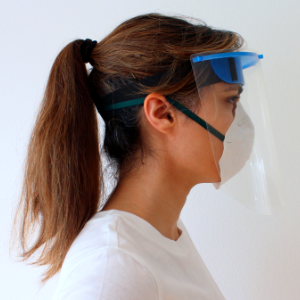
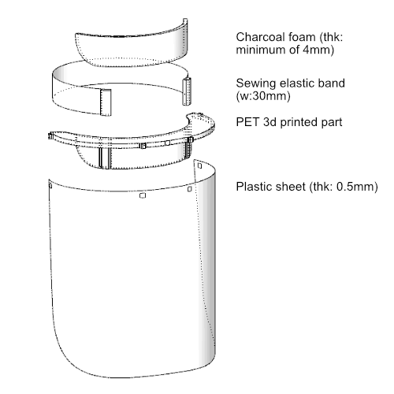

### *---This page is continiously being updated and the content is subject to revision---*
# SHL-face-shield

 

*It corresponds to both safety regulations and ergonomics while it is optimized for quick 3d printing. 
The design is built on best practices, co-creation with users' feedback, and several prototypes. 
The project started in response to the Covid-19 outbreak to support the supply chain of non-proprietary protective items.*

### Instructions:

* 3D print mesh is provided in the .stl format(units:mm)
* Laser cut drawing for the shield and forhead foam are in .dxf format(units:mm)
* The clear plastic can be any type suitable for laser cuttig.
#### Print settings:
Following settings tested on Ultimaker3:
* Material: 3DE PETG
* Nozzle size: 0.8mm
* Speed: 90 mm/s
* Temperture: 235-245 
* Wall thickness: 1.37 mm
* Fan speed: 100%
* Infill: 0%*

### Credits:
The design is built on several other open source projects including [PrusaRC2](https://www.prusaprinters.org/prints/25857-prusa-protective-face-shield-rc2/files) and [DK makers mod Corona](https://www.makersmodcorona.dk/hjaelp-med-at-printe).
### Contact:[alimirakbari](https://github.com/alimirakbari)
